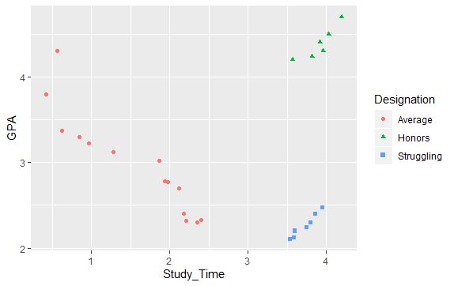
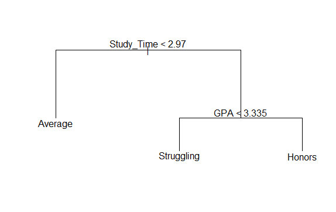

# Student Designation
## Predicting student classification as an honors, average, or struggling student.

### The StudentData dataset contains three variables:
- **Designation**: A variable that classifies each student as an honors, average, or struggling student.
- **GPA**: The student's current GPA.
- **Study_Time**: The number of hours that a student self-reports studying per night.

### Executing "tree" and "tidyverse" libraries
```
library(tree)
library(tidyverse)
```
### Setting working directory
```
print(getwd())
setwd("C:/Users/Kuanysh/Documents/GitHub/R-programming/Decision_Tree/Student_designation")
```
### Reading StudentData
```
student_data <- read.csv("StudentData.csv", fileEncoding = "UTF-8-BOM")
```
### Exploring data
```
print(student_data)
summary(student_data)
```
### Plotting scatterplot to see correlation
```
ggplot(data = student_data) +
  geom_point(mapping = aes(x=Study_Time, y= GPA, color=Designation, shape=Designation))
```

### Constructing decision tree
```
tree.student_data = tree(Designation~., data = student_data)
```
### Plotting tree
```
plot(tree.student_data)
text(tree.student_data, pretty = 0)
```

### We built our tree
```
tree.student_data
```
### Recap
If you dedicate less than 2.97 hours time to study, most probably you are an average student. However, if you spend more time and your GPA is greater than 3.335 you will graduate with honor. Otherwise, you are just struggling student.
